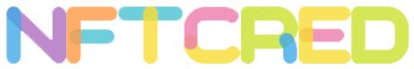

  </a>

## Intro

This is a project developed as part of the interview process for a Senior Fullstack Enablement Engineer at Consensys. It consists of a PoC assignment for developing an NFT Collateralized Lending/Borrowing Platform using Consensys Products. This mono repository contains is organized as following:

- [x] blockchain: smart contract project in Ethereum to handle the lending/borrowing dynamics. Read the README.md file for more details.
- [x] services: backend and frontend implementation of the platform. Read the README.md file for more details.
- [x] misc: contains misc files, such as my presentations during the interview process.

## Infrastructure: Deploy in AWS

We use AWS CDK (Cloud Development Kit) to manage the services of this project (api and app). For more details about how to deploy on AWS, please read `cloud/cdk/README.md`.

## Additional info and resources

### Faucets

- https://linea.faucetme.pro/

### Bridge goerli ether to linear

- https://medium.com/@mbohlahcok22/tutorial-bridge-eth-from-goerli-to-linea-smart-contracts-fc91eaf3b10d
- https://www.youtube.com/watch?v=UjPAjp-n0Zk
- https://goerli.hop.exchange/
- https://bridge.linea.build/
