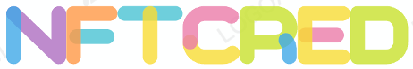

# NFTCred

Fill in the details below to list your NFT for collateral or to request a loan. Provide your NFT and token contract addresses, specify the loan duration, and the amount you wish to borrow.

  </a>

## Description

This is a project developed as part of the interview process for a Senior Fullstack Enablement Engineer at Consensys. It consists of a PoC assignment for developing an NFT Collateralized Lending/Borrowing Platform using Consensys Products. This mono repository contains is organized as following:

- [x] blockchain: smart contract project in Ethereum to handle the lending/borrowing dynamics. Read the README.md file for more details.
- [x] web: backend and frontend implementation of the platform. Read the README.md file for more details.
- [x] presentations: files related to my presentation during the interview process.

## Features in a Nutshell

## TODO

Please, read the file ``TODO.md`` of each root folder.

## Additional info and resources

### Faucets

- https://linea.faucetme.pro/

### Bridge goerli ether to linear

- https://medium.com/@mbohlahcok22/tutorial-bridge-eth-from-goerli-to-linea-smart-contracts-fc91eaf3b10d
- https://www.youtube.com/watch?v=UjPAjp-n0Zk
- https://goerli.hop.exchange/
- https://bridge.linea.build/